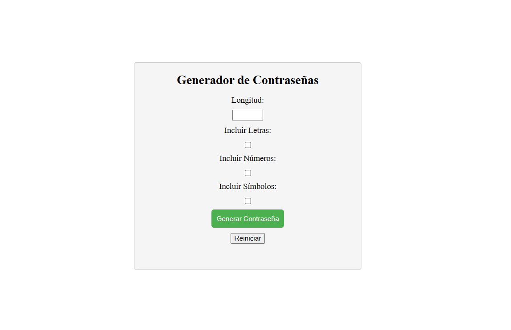

# Generador de Contraseñas

Este es un proyecto que implementa un generador de contraseñas desarrollado con Python y Flask. La aplicación web permite a los usuarios generar contraseñas aleatorias con opciones personalizables.

## Funcionalidades

- Permite al usuario especificar la longitud deseada para la contraseña.
- El usuario puede elegir incluir letras, números y/o símbolos en la contraseña generada.
- Verifica que al menos un tipo de caracteres esté seleccionado antes de generar la contraseña.
- Muestra la contraseña generada en pantalla.
- Incluye botones para reiniciar el campo de contraseña y generar una nueva contraseña con los mismos parámetros seleccionados.

## Tecnologías utilizadas

- Python
- Flask (framework de desarrollo web en Python)
- HTML
- CSS
- JavaScript (incorporado directamente en el archivo HTML)

## Cómo ejecutar la aplicación

1. Clona este repositorio en tu máquina local:
git clone https://github.com/jamirou/randompasswords.py.git

2. Asegúrate de tener Python y Flask instalados en tu entorno.

3. Navega al directorio del proyecto

4. Instala las dependencias del proyecto
  
5. Ejecuta la aplicación
   
6. Abre tu navegador web y visita [http://localhost:5000](http://localhost:5000).

7. Utiliza el generador de contraseñas para crear contraseñas de forma aleatoria.

## Personalización

Si deseas personalizar el estilo de la aplicación, puedes editar el archivo `styles.css`. Los cambios se reflejarán en la apariencia de la interfaz.

## Contribución

Si deseas contribuir a este proyecto, puedes seguir los siguientes pasos:

1. Haz un fork de este repositorio.

2. Crea una nueva rama para tus cambios:
git checkout -b feature/nueva-funcionalidad

3. Realiza tus modificaciones y guarda los cambios.

4. Haz un commit de tus cambios:
git commit -m "Añade nueva funcionalidad"

5. Haz push de tus cambios a tu repositorio fork:

6. Abre un pull request en este repositorio desde tu rama fork.

7. Estaré encantado de revisar tu contribución.

¡Gracias por tu interés en este proyecto!

